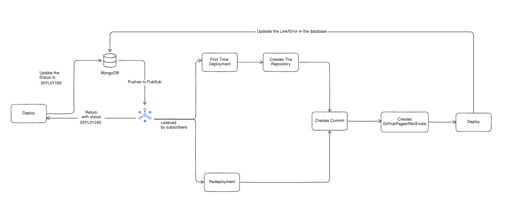

# IITGWebPro Server
This repository consists the server-side code of IITGWebPro. IITGWebPro is a platform which enables the users to generate websites from AI and edit them using a no-code interface.

# Technical Information
1. See [CONTROLLERS.md](CONTROLLERS.md) for getting all the information related to the exposed APIs.
2. See [INSTALLATION.md](INSTALLATION.md) for running the server locally on your machine.

# [EXPERIMENTAL] Auto-Deployment Feature
This section consist the core architecture of Auto-Deployment by using an internal Pub-Sub and GitHub Pages.

